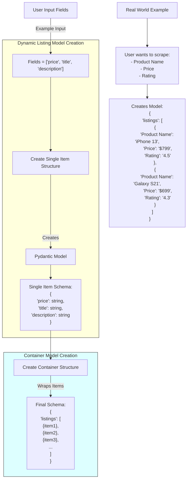
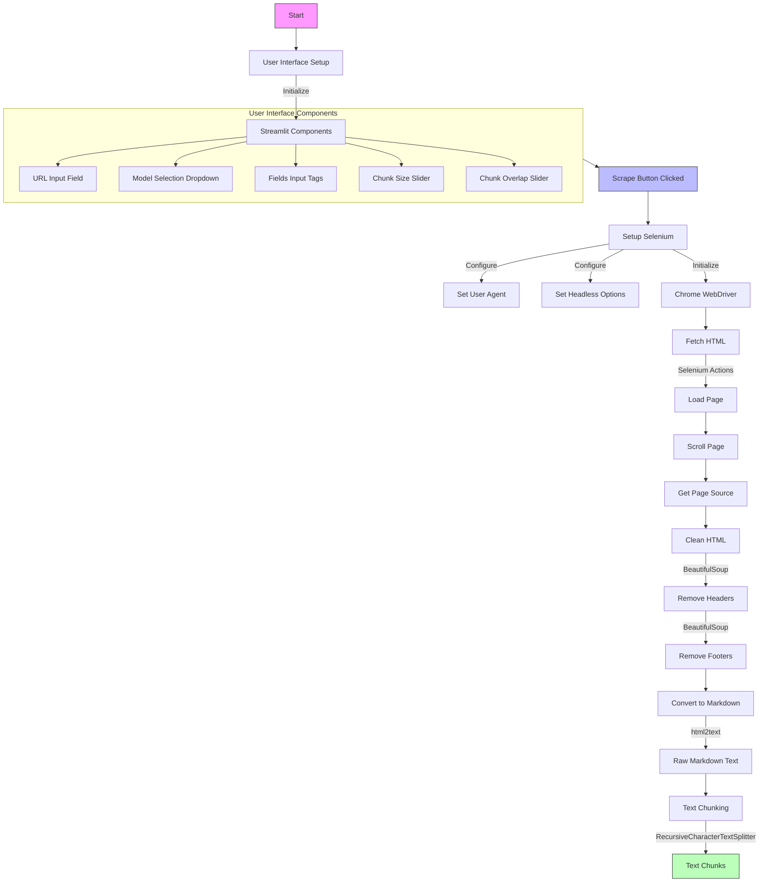

# 🌟 Universal Web Scraping - AI Processing Pipeline

## 🎓 Infosys Springboard Internship

Excited to present the completion of my Infosys Springboard Internship Milestone 3! This project combines advanced web scraping with AI-powered data processing to create a flexible, robust data extraction pipeline.

## 🚀 Features

- **Multi-Provider AI Integration**: Support for OpenAI, Google Gemini, Llama, and Groq
- **Smart Web Scraping**: Selenium-based scraping with intelligent scroll handling
- **Advanced Text Processing**: Customizable chunking with overlap control
- **Dynamic Model Generation**: Creates data models based on user-defined fields
- **Multiple Export Formats**: JSON, CSV, Excel, and Markdown output options
- **Cost Tracking**: Automated token counting and cost calculation
- **User-Friendly Interface**: Streamlit-based UI with intuitive controls

## 🛠️ Technologies and Tools Used

- **Python**: Core scripting language for logic and data handling
- **Selenium & Playwright**: Dynamic web scraping and content handling
- **Pydantic**: Data processing, model generation, and validation
- **Streamlit**: Creating an intuitive and interactive user interface
- **LangChain & LangSmith**: For structured AI-driven data extraction and workflow tracking
- **ChatGoogleGenerativeAI & ChatGroq**: Enhancing AI model efficiency and accuracy

## 📊 System Architecture

### Dynamic Container Model


### AI Processing Pipeline


## UI


## 🔄 Web Scraping Workflow

### 1️⃣ URL Retrieval
- Utilized Selenium with randomized user agents for anonymity
- Automated cookie consent handling for seamless navigation
- Implemented dynamic scrolling to load complex page content
- Captured the full HTML source for further processing

### 2️⃣ HTML Processing
- Cleaned HTML by removing headers, footers, and unnecessary elements
- Converted HTML to markdown format using html2text
- Removed URLs and preserved only meaningful content

### 3️⃣ Data Extraction Strategy
- Generated dynamic models based on user-specified fields using Pydantic
- Integrated multiple AI models for intelligent extraction:
  - GPT-4
  - Gemini-1.5 Flash
  - Llama3.1 (Local/Groq)
- Designed chunk-based processing for large content
- Produced structured JSON outputs

### 4️⃣ Token & Cost Management
- Tracked input and output tokens across models
- Calculated per-model costs with different pricing schemes
- Provided transparent cost metrics

### 5️⃣ Output Options
- Exported results in JSON, CSV, and Excel formats
- Preserved markdown versions for documentation
- Enabled comprehensive logging

## Output


## ⚙️ Unique Aspects

- **Adaptive Extraction**: Models adjust dynamically to user specifications
- **Multi-Model Support**: Flexible AI model selection
- **Transparent Token Tracking**: Detailed usage and cost insights

## 🚀 Future Enhancements

- Transitioning to a scalable backend using FASTAPI
- Leveraging LangGraph for graph-based AI visualizations

## 📚 Learning Resources

- Web Scraping: @John Watson Rooney YouTube Channel
- LangChain & AI: **Krish Naik** Sir's Udemy Course
- Documentation: The ultimate teacher!

## 🔧 Installation

```bash
# Clone the repository
git clone https://github.com/yourusername/webscraping-ai-pipeline.git
cd webscraping-ai-pipeline

# Install dependencies
pip install -r requirements.txt

# Set up environment variables
cp .env.example .env
# Edit .env with your API keys

# Run the application
streamlit run app.py
```

## Resources Followed

Mr. Krish Naik for his comprehensive AI courses
John Watson Rooney for web scraping tutorials
Fellow interns for their collaboration and support

## 📜 License
This project is licensed under the GNU General Public License v3.0 - see the LICENSE file for details.

## 🙏 Acknowledgments
I want to express my sincere gratitude to:
### Infosys Springboard Team

- The mentors who provided invaluable guidance throughout the internship
- The technical team for their support in overcoming challenges
- The program coordinators for organizing this learning opportunity

### Technical Community

- The open-source community for providing excellent tools and libraries
- Stack Overflow contributors for their helpful solutions
- GitHub community for code examples and inspiration


## 🤝 Connect With Me

I'd love to hear your thoughts and suggestions! Feel free to connect and share your ideas.

## Contact Information
For questions or collaboration opportunities:

[](mailto:rahulsamantcoc2@gmail.com)  [](https://github.com/rahulsamant37/)  [](https://www.linkedin.com/in/rahul-samant-kb37/)
